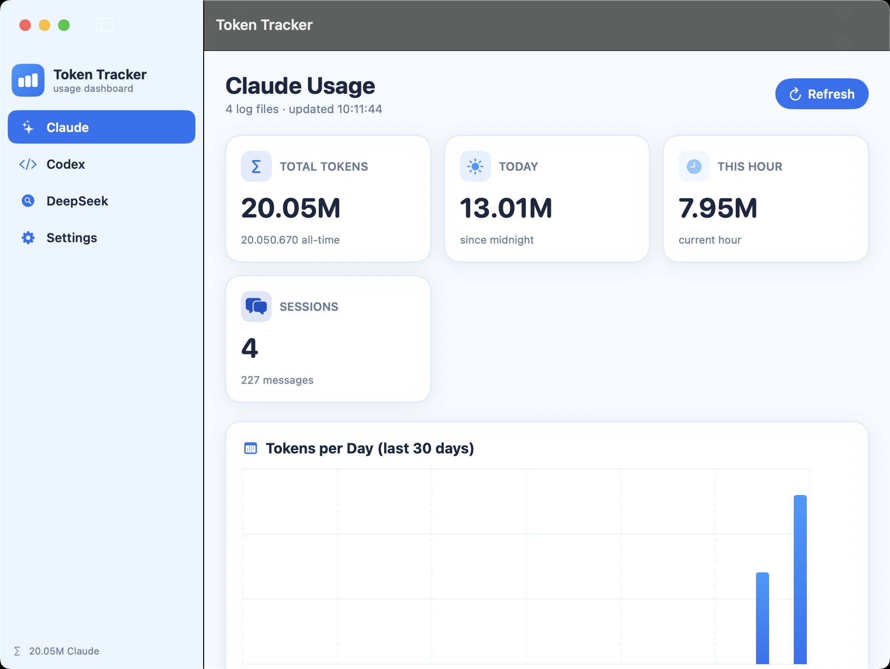

# Token Tracker

A native **SwiftUI** macOS app that tracks token usage for **Claude**, **Codex**, and **DeepSeek** in one white-and-blue dashboard. All data stays on your Mac — nothing is uploaded.



## Features

| Tracker | Source | Needs a key? |
|---------|--------|--------------|
| **Claude** | Reads Claude Code logs at `~/.claude/projects/**/*.jsonl` | No |
| **Claude API usage** | Calls Anthropic's Usage & Cost Admin API | Yes (admin key) |
| **Codex** | Reads Codex rollouts at `~/.codex/sessions/**/*.jsonl` | No |
| **Codex API usage** | Calls OpenAI's Usage & Costs Admin API | Yes (admin key) |
| **DeepSeek** | Calls the DeepSeek balance API | Yes (API key) |

Each tracker shows **tokens per session, per hour, per day, and total** — exactly as requested — plus extras tailored to each provider.

### Claude dashboard
- Total tokens (all-time) with input / output / cache-write / cache-read breakdown
- Tokens today and this hour
- Tokens per day (30-day bar chart) and per hour (24-hour area chart)
- Tokens per session (ranked) and per model
- **API Usage & Cost section** — real organization spend and tokens from Anthropic's Usage & Cost API (needs an admin key)

### Codex dashboard
- Total tokens with input / cached-input / output / reasoning breakdown
- Tokens today, this hour, per day, per hour, per session, per model
- **Rate-limit gauges** (Codex's 5-hour and weekly windows) with reset times, credits balance, and model context window
- **API Usage & Cost section** — real organization spend and tokens from OpenAI's Usage & Costs API (needs an admin key)

### API Usage & Cost (Claude + Codex)

Each of the Claude and Codex dashboards has an **API Usage & Cost** section that pulls billing data straight from the provider — independent of the local logs:

- Total cost and cost today (USD), total tokens and tokens today
- Cost-per-day and tokens-per-day bar charts (last 30 days)
- Input / output / cache token breakdown and a per-model breakdown

These sections require an **organization admin key** — Anthropic `sk-ant-admin01-…` or OpenAI `sk-admin-…`, distinct from a normal API key and available only to organization accounts. Add them under **Settings → Claude API Usage / Codex API Usage**. Without a key the section just shows a "connect" prompt; the log-based tracking is unaffected.

### DeepSeek dashboard
- **Credit left** (color-coded green → amber → red as it runs low)
- Credit used (total and today)
- Balance-over-time chart and credit-used-per-day chart
- Granted vs. topped-up composition

## Install

Download / clone, then:

```bash
./build.sh      # compiles TokenTracker.app + builds TokenTracker-Installer.dmg
./install.sh    # copies to /Applications and launches it
```

Or open `TokenTracker-Installer.dmg` and drag **Token Tracker** onto Applications.

> Requires only the Xcode **Command Line Tools** (`xcode-select --install`) — no full Xcode. Built and tested on Apple Silicon, macOS 14+.

## Configure

Open **Settings** in the app:
- **DeepSeek API key** — paste your key, press *Save & Test*. Used only to call DeepSeek's own balance endpoint.
- **Claude API Usage** — paste your Anthropic **admin** key (`sk-ant-admin01-…`). Used only to call Anthropic's Usage & Cost API.
- **Codex API Usage** — paste your OpenAI **admin** key (`sk-admin-…`). Used only to call OpenAI's Usage & Costs API.
- **Claude / Codex log folders** — override the defaults if your logs live elsewhere.
- **Auto-refresh** — off / 15s / 30s / 1m / 5m.

## How it reads usage

- **Claude** — each assistant message in the JSONL logs carries a `usage` object (`input_tokens`, `output_tokens`, `cache_creation_input_tokens`, `cache_read_input_tokens`). Totals are summed across all sessions.
- **Codex** — `token_count` events carry a **cumulative** `total_token_usage`. The app computes per-turn deltas between consecutive events (summing the raw `last_token_usage` would double-count), so totals are exact.
- **Claude / Codex API usage** — the app calls the provider's daily usage and cost reports (Anthropic `/v1/organizations/usage_report/messages` + `/cost_report`; OpenAI `/v1/organization/usage/completions` + `/costs`) for the last 30 days, grouped by model. Anthropic returns cost in cents (converted to USD); OpenAI returns cost in USD. Tokens are normalised so input / output / cache categories never double-count. The last result is cached locally so the dashboard renders before the first refresh.
- **DeepSeek** — the balance API only reports the *current* balance, so the app snapshots it on each refresh and derives "credit used" from the change over time. Usage history therefore builds up while the app is in use.

See [docs/ARCHITECTURE.md](docs/ARCHITECTURE.md) for the full data model and design.

## Privacy

Everything runs locally. Claude and Codex logs are read from disk; the DeepSeek key is stored in local `UserDefaults` and is sent only to `api.deepseek.com`. The Anthropic and OpenAI admin keys are likewise stored in local `UserDefaults` and sent only to `api.anthropic.com` / `api.openai.com` to read your own usage. The repository contains **no secrets**.

## Project layout

```
Sources/
  TokenTrackerApp.swift        app entry, sidebar nav, auto-refresh
  Theme.swift                  white/blue palette + number formatters
  Components.swift             cards, stat tiles, shared UI
  ClaudeUsage.swift            Claude JSONL scanner + aggregations
  ClaudeDashboardView.swift    Claude charts & tiles
  CodexUsage.swift             Codex rollout scanner (cumulative→delta) + rate limits
  CodexDashboardView.swift     Codex charts, tiles & rate-limit gauges
  APIUsage.swift               shared usage/cost models, store protocol + HTTP helper
  ClaudeAPIUsage.swift         Anthropic Usage & Cost Admin API client
  CodexAPIUsage.swift          OpenAI Usage & Costs Admin API client
  APIUsageSection.swift        shared cost/token dashboard section (embedded in Claude & Codex)
  DeepSeek.swift               balance API client + snapshot history
  DeepSeekDashboardView.swift  DeepSeek charts & tiles
  SettingsView.swift           settings
Tools/makeicon.swift           generates the app icon
build.sh                       compile + bundle .app + DMG
install.sh                     install into /Applications
docs/                          documentation
```

## License

MIT — see [LICENSE](LICENSE).
